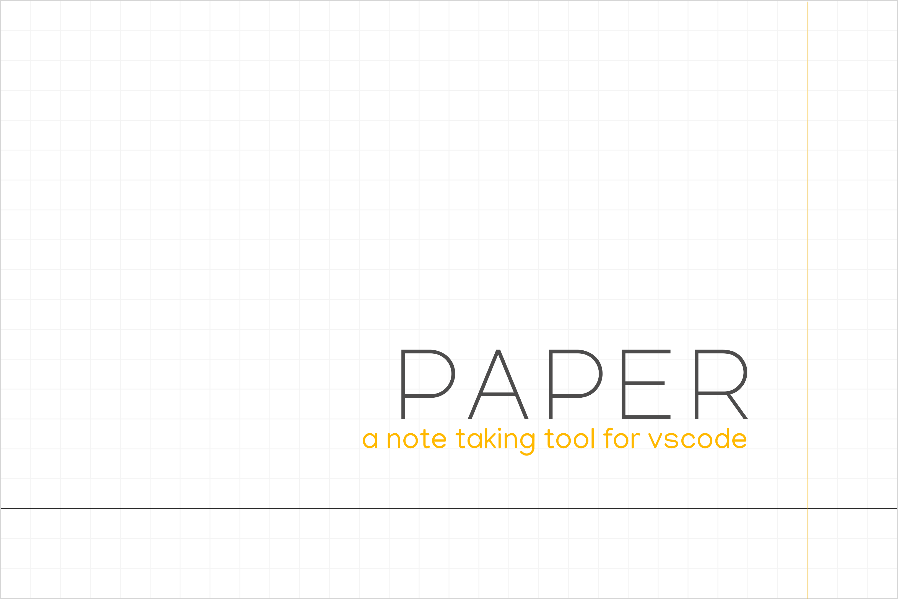

 
 

Paper is a note taking tool for VSCode. The motivation behind Paper is to create a tool that will let developers keep frequently accessed files and locations within files (functions, classes and etc) bookmarked for easy access.

 

### Install the extension

You can install the [extension](https://marketplace.visualstudio.com/items?itemName=Raathigeshan.paper) from VSCode marketplace.

 

### Shortcuts

-   `# <space>` - Creates a H1 heading
-   `## <space>` - Creates a H2 heading
-   `### <space>` - Creates a H3 heading
-   `- <space>` - Creates a list

 

### Features

#### Bookmark active file

Click the file icon in the floating menu to create a bookmark for the active file.

This is helpful if you want to bookmark a file that you frequently visit while implementing a feature.

 

#### Bookmark selection

Select text in a file and click the the pointer icon in the floating menu to create a bookmark to the selection.

Using this feature you can bookmark any number of locations in your codebase you jump visit often.

 

#### File tree

A file tree widget shows you the files under a particular path as a tree view.

This helps to keep a particular directory in-sight if don't want to scroll through in VSCode's tree view.

 

 
